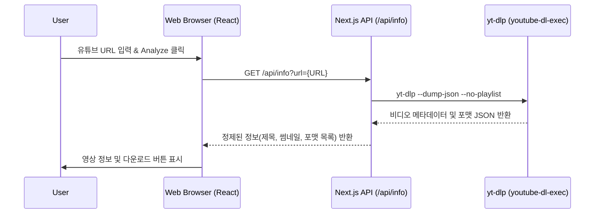
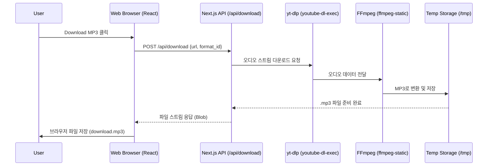
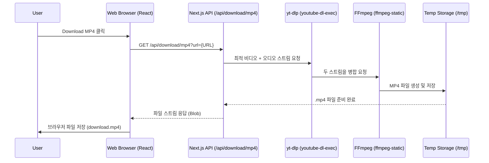

# Project Sequence Diagrams

이 프로젝트의 주요 이벤트 흐름을 시퀀스 다이어그램으로 정리하였습니다. Mermaid 문법을 사용하여 작성되었습니다.

---

## 1. 비디오 정보 분석 (Analyze Video Info)
사용자가 URL을 입력하고 'Analyze' 버튼을 눌렀을 때의 흐름입니다.

---

## 2. MP3 다운로드 (Download MP3)
사용자가 'Download MP3' 버튼을 클릭했을 때의 오디오 추출 및 변환 흐름입니다.

---

## 3. MP4 다운로드 (Download MP4)
사용자가 'Download MP4' 버튼을 클릭했을 때의 비디오/오디오 병합 흐름입니다.

